# Clipping Primitives

Clipping primitives can be used to dynamically slice away a mesh and peer inside the geometry. This is useful whenever you need to inspect the inner workings of a complex model. 

A clipping primitive represents an analytic shape that passes its state and transformation data into a [material parameter collection](https://docs.unrealengine.com/en-US/RenderingAndGraphics/Materials/ParameterCollections/index.html). [Material functions](https://docs.unrealengine.com/en-US/RenderingAndGraphics/Materials/Functions/index.html) can then take this primitive data and perform calculations, such as returning the signed distance from the shape's surface.

> [!NOTE] 
> The clipping algorithm is optimized for mixed reality but requires the use of [masked or translucent](https://docs.unrealengine.com/en-US/RenderingAndGraphics/Materials/MaterialProperties/BlendModes/index.html) materials. Masked and translucent materials have additional overhead over opaque ones and should be used sparingly.

Graphics Tools contains a few clipping primitive types for developers to pick from. All clipping primitive components derive from the `UGTClippingPrimitiveComponent`.

> [!NOTE] 
> By default, Graphics Tools only transfers the data of one clipping primitive per type per level to materials (i.e., only one `MF_GTClippingSphere`, `MF_GTClippingBox`, etc. has an effect within a level.) To utilize more than one clipping primitive per type per level please see the [advanced usage](#Advanced-usage) section.

### Clipping Plane

The `UGTClippingPlane` component (or actor) represents an infinite plane. The plane's position is controlled by the component's transform location and plane normal is determined by transform's x axis direction. Use the `MF_GTClippingPlane` material function to calculate a point's signed distance from the primitive.

### Clipping Sphere

The `UGTClippingSphere` component (or actor) represents a sphere (or [ellipsoid](https://en.wikipedia.org/wiki/Ellipsoid)). The sphere's location, rotation, and scale is controlled by the component's transform. Non-uniform scales will turn the sphere into a ellipsoid. Use the `MF_GTClippingSphere` material function to calculate a point's signed distance from the primitive.

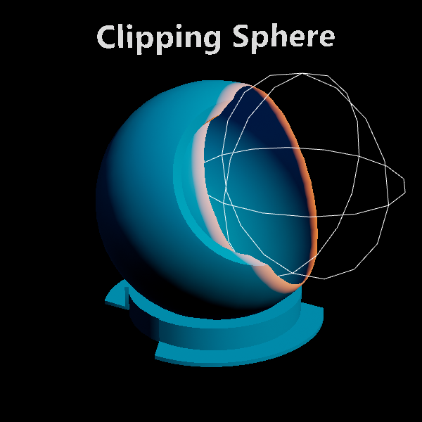

### Clipping Box

The `UGTClippingBox` component (or actor) represents a box (i.e., cube). The box's location, rotation, and scale are controlled by the component's transform. Use the `MF_GTClippingBox` material function to calculate a point's signed distance from the primitive.

### Clipping Cone

The `UGTClippingCone` component (or actor) represents a cone or more exactly a resizable capped cylinder. The cone's location and rotation are controlled by the component's transform. The component transform's scale controls the cone's height, bottom cap radius, and top cap radius with the x, y, and z values respectively. Use the `MF_GTClippingCone` material function to calculate a point's signed distance from the primitive.

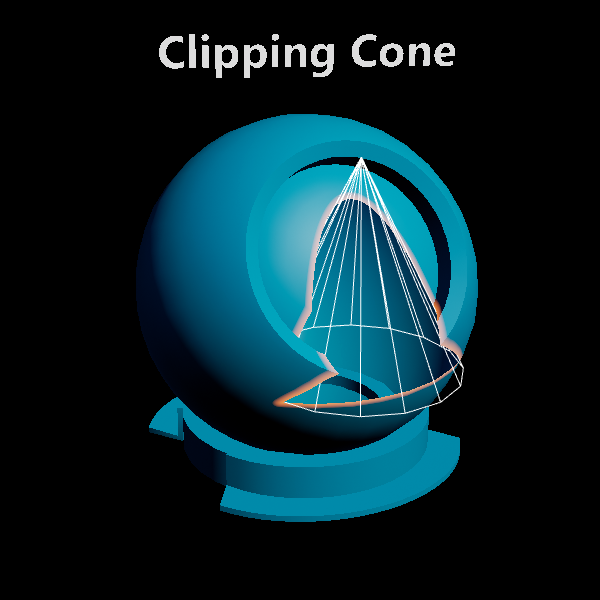
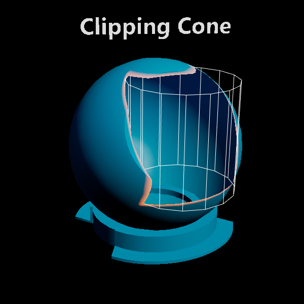

## Example level

There are demonstrations of clipping primitive techniques within the `\GraphicsToolsProject\Plugins\GraphicsToolsExamples\Content\ClippingPrimitives\ClippingPrimitives.umap` level.

## Example usage

In the following steps we will create a new material that when applied to a mesh will perform per pixel clipping based on clipping primitives within a level.

1. First we will create a material.
    * Right click within the "Content Browser" and select "Material" under the "Create Basic Asset" menu listings.
    * Let's name our material `M_ClippingPrimitives`.
    * Double click on `M_ClippingPrimitives` to open the material editor.

2. It's good practice to keep your materials simple (in other words keep the number of shader instructions low) when authoring materials for Mixed Reality. 
    * To ensure this, mark `M_ClippingPrimitives` as "Unlit" (1) in the material's "Shading Model" property.
    * Next, mark the material as "Masked" (2). This tell's Unreal's renderer that this material will discard pixels and exposes the "Opacity Mask" input.
    * Masked materials have another important parameter called "Opacity Mask Clip Value" for our use case set this value to zero. (3) This value specifies a threshold at which pixels with opacity masks under this value will be discarded. 
    * (Optional) Mark the material as "Two Sided" (4). Two sided materials disable [back face culling](https://en.wikipedia.org/wiki/Back-face_culling), which can decrease rendering performance, but is sometimes desireable when peering inside a model.  
    * (Optional) If you would like your material to still look as though it is lit, then right click on the material graph and add the `MF_GTDefaultLit` material function. Connect the result of the `MF_GTDefaultLit` to the material's "Emissive Color." (5)

    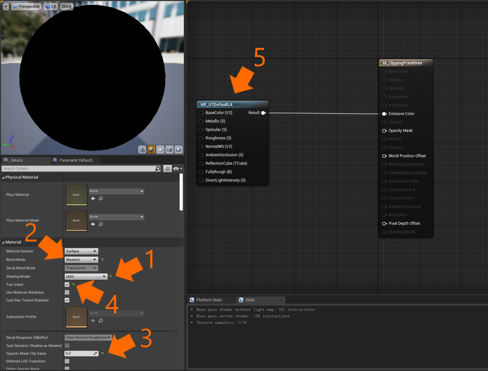

3. Next let's give our material a base color. Very few materials exist in the real world are completely black (and completely black materials render transparently on additive displays like the one found on HoloLens 2). 
    * Right click on the material graph and add a `ConstantVector3` node. 
    * Set the node's RGB channels to 0.2, 0.2, and 0.5 respectively, a muted purple color.
    * Connect this node to the `BaseColor` input of the `MF_GTDefaultLit` material function. (1) Or "Emissive Color" if you opted not to use the `MF_GTDefaultLit` function in step 2.

    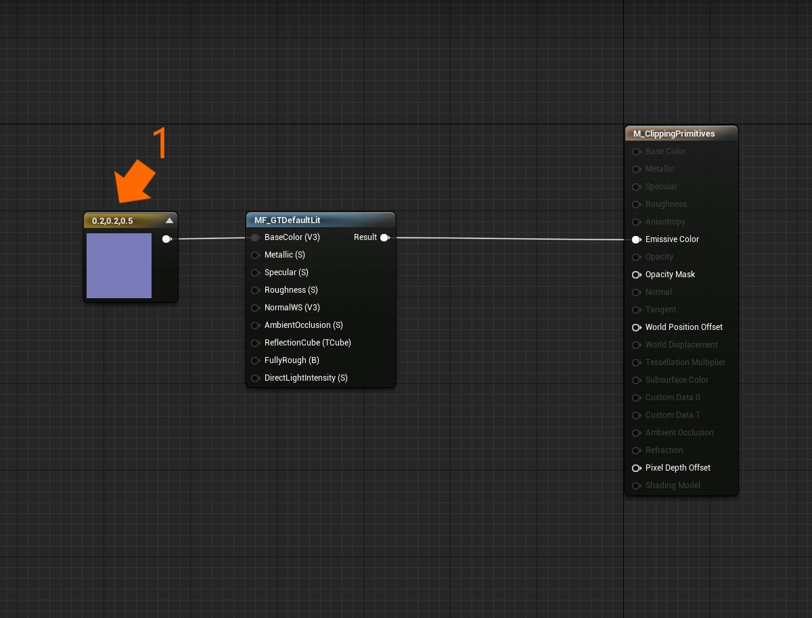

4. Our material now needs to add clipping primitive calculations. Let's start with a clipping sphere.
    * To do this right click on the material graph and add the `MF_GTClippingSphere` material function (1). 
    * Connect the result of `MF_GTClippingSphere` to the material's "Opacity Mask."
    * Note, you don't need to connect any inputs to the `MF_GTClippingSphere` by default. For an explanation as to why read on to the [advanced usage](#Advanced-usage) section below. 

    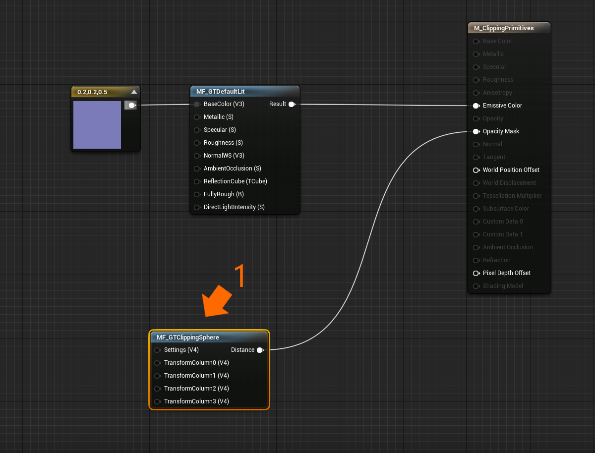

5. It's time to preview our material interacting with a clipping sphere. 
    * First let's create a new level (File > New Level) and select "Empty Level." 
    * From the "Place Actors" panel drop a `Sphere` actor into the level. 
    * With the `Sphere` actor selected change the material to our newly created material, `M_ClippingPrimitives`. 
    * Scale the sphere down to about 25% so that it's not so large.

    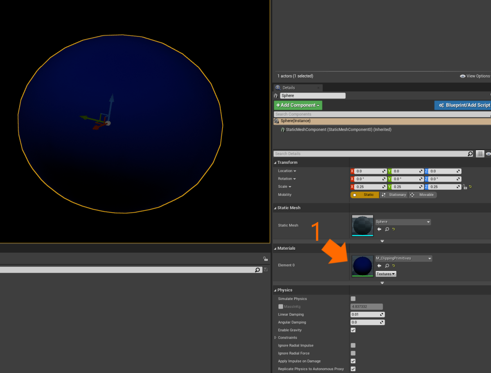

6. You may notice now that our `Sphere` actor is very dark. To fix this let's add a directional light to our scene. Because we are using the `MF_GTDefaultLit` material function we must use a `GTDirectionalLight` actor (or component). 
    * From the "Place Actors" panel drop a `GTDirectionalLight` actor into the level. 
    * Set the `GTDirectionalLight`'s "Intensity" to 2. The default value represents a "sunny day" and may wash out our material. More information about the `GTDirectionalLight` component can be found in the [lighting](Lighting.md) documentation.

7. It's now time to add a clipping sphere to the level. 
    * From the "Place Actors" panel drop a `GTClippingSphere` actor into the level. 
    * Move the `GTClippingSphere` actor around until it intersects the surface of the the `Sphere` actor. You will notice the sphere discards any pixels that intersect with it. (1) 
    * Try experimenting with different clipping primitive settings by toggling the "Clipping Side" from "Inside" to "Outside" to see how pixels get discarded. Or try changing the size of clipping sphere via scale. If you non-uniformly scale the clipping sphere it will clip pixels within an ellipsoid shape.  
    * If you want to disable the clipping sphere without removing the actor you can uncheck the "Visible" flag under the "Rendering" properties.

    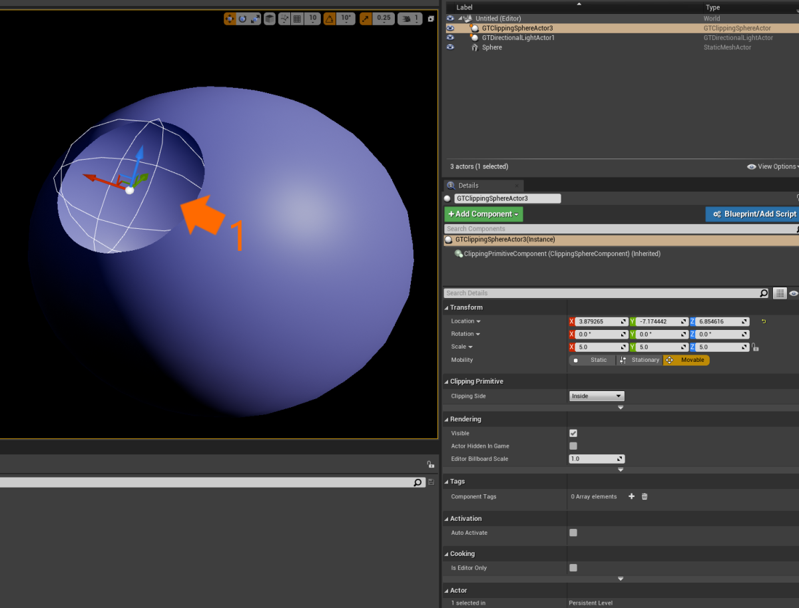

7. It can be a bit difficult to discern the border between clipped and non-clipped pixels. To remedy this let's add a border highlight.
    * Double click on the `M_ClippingPrimitives` material to reopen the material editor.
    * Right click on the material graph and add the `MF_GTClippingBorder` material function (1).
    * Add the result of `MF_GTClippingBorder` to the current "Emissive Color" input. (2)

    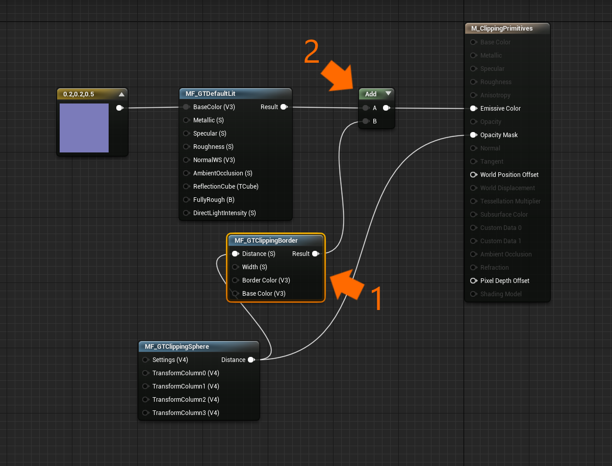

    * Save the material and jump back to the level editor. You should now see an orange highlight that outlines the clipping border. (1)
    * (Optional) Open the `M_ClippingPrimitives` material and try adjusting the `MF_GTClippingBorder`'s "Width" and "Border Color" to see how the border changes.

       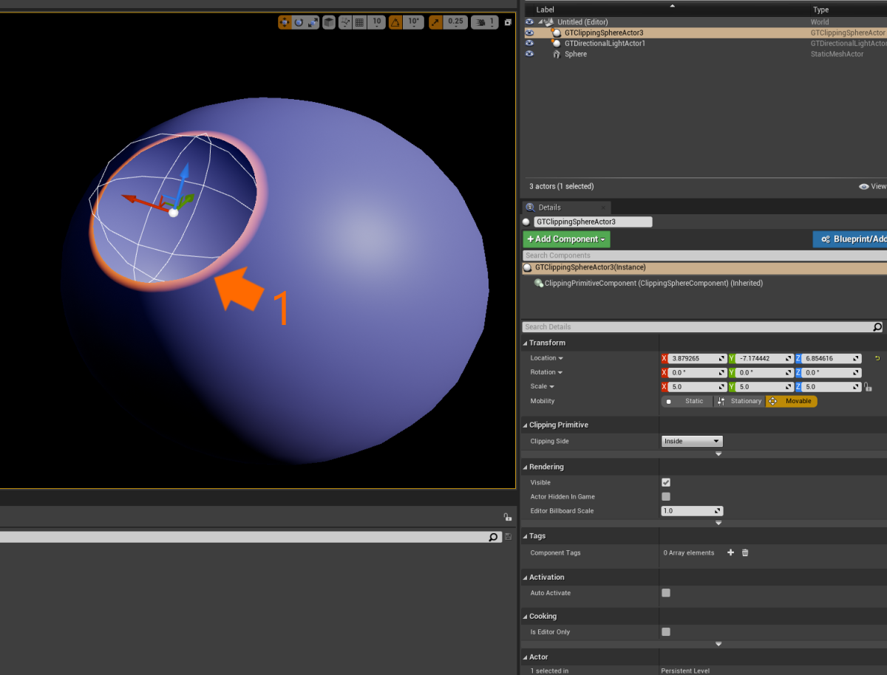

8. Some scenarios require more than one clipping primitive to be used at once. Let's modify our material so that it can also be clipped by a clipping box.
    * Open the `M_ClippingPrimitives` material in the material editor.
    * Right click on the material graph and add the `MF_GTClippingBox` material function (1).
    * Right click on the material graph and add the `Min` material function (2).
    * Connect the output of `MF_GTClippingSphere` to the "A" input of `Min` and the output of `MF_GTClippingBox` to the "B" input of `Min`.
    * Connect the output of `Min` to the material's "Opacity Mask" and to the "Distance" input of `MF_GTClippingBorder`.
    * Note, any combination of clipping primitives can be "summed" using the min of their outputs.

    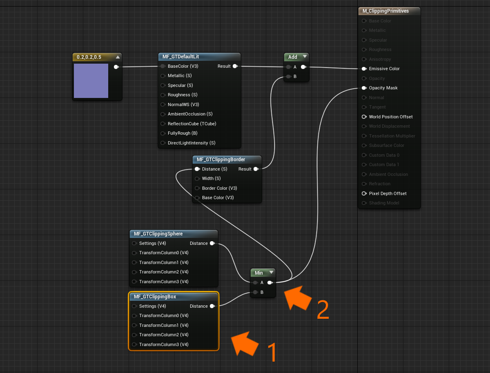

7. Now let's add a clipping box to the level. 
    * Jump back to the level editor and from the "Place Actors" panel drop a `GTClippingBox` actor into the level. 
    * Move the `GTClippingBox` actor around until it intersects the surface of the the `Sphere` actor. You will notice the sphere and box discard any pixels that intersect with them. (1)

    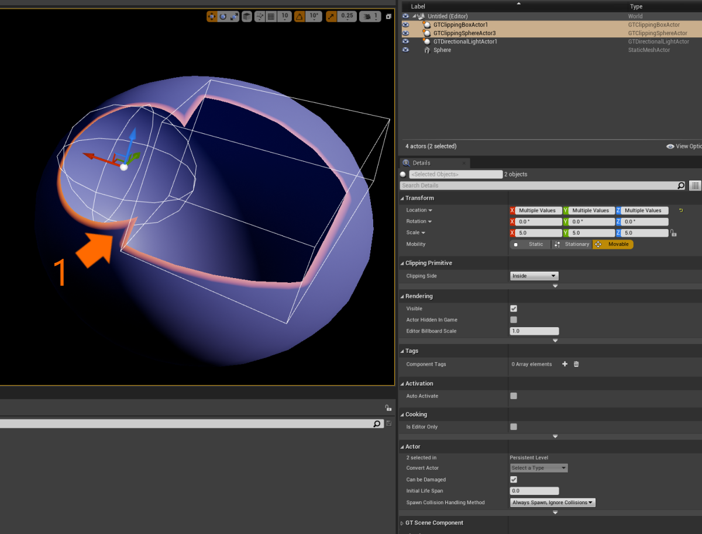

## Advanced usage

In the above example you may have noticed that the `MF_GTClippingSphere`, `MF_GTClippingBox`, etc. material functions had inputs that we never connected to anything. This is because Graphics Tools automatically manages the transfer of data from a clipping primitive to a material for one instance of a clipping primitive (`GTClippingSphere`, `GTClippingBox`, etc.). If you were to add a second primitive to a level it would be ignored by the clipping functions by default. Some apps require more than one type of clipping primitive in use at a time. We will demonstrate how to achieve this below. 

> [!NOTE]
> Having many clipping primitives effect a material will increase pixel shader instructions and will impact performance. Please profile these changes within your project.

*How to add a second clipping sphere to a level. Note, the same technique can be used on any primitive and for any permutation of primitives.*

1. First we will create a material.
    * Right click within the "Content Browser" and select "Material" under the "Create Basic Asset" menu listings. 
    * Let's name our material `M_TwoClippingSpheres`. 
    * Double click on `M_TwoClippingSpheres` to open the material editor.

2. Next configure the material for primitive clipping.
    * Mark the material as "Masked" (1). This tell's Unreal's renderer that this material will discard pixels and exposes the "Opacity Mask" input.
    * Masked materials have another important parameter called "Opacity Mask Clip Value" for our use case set this value to zero. (2) This value specifies a threshold at which pixels with opacity masks under this value will be discarded.
    * Next, it is recommended to mark materials as "Unlit" and to use the `MF_GTDefaultLit` function. But, to simplify this demonstration we will use Unreal's default lighting model. 
    * Finally give the material a base color. Right click on the material graph and add a `ConstantVector3` node. (3) Set the node's RGB channels to 0.2, 0.8, and 0.2 respectively, a slime green color. And connect the color to the "Base Color" input.

    

3. Our material now needs to add clipping primitive calculations.
    * Right click on the material graph and add a `MF_GTClippingSphere` material function (1).
    * Right click on the material graph again and add a second `MF_GTClippingSphere` material function (2).
    * Right click on the material graph one more time and add the `Min` function (3).
    * Connect the output of the first `MF_GTClippingSphere` to the "A" input of `Min` and the output of the second `MF_GTClippingSphere` to the "B" input of `Min`.
    * Connect the output of `Min` to the material's "Opacity Mask."
    
    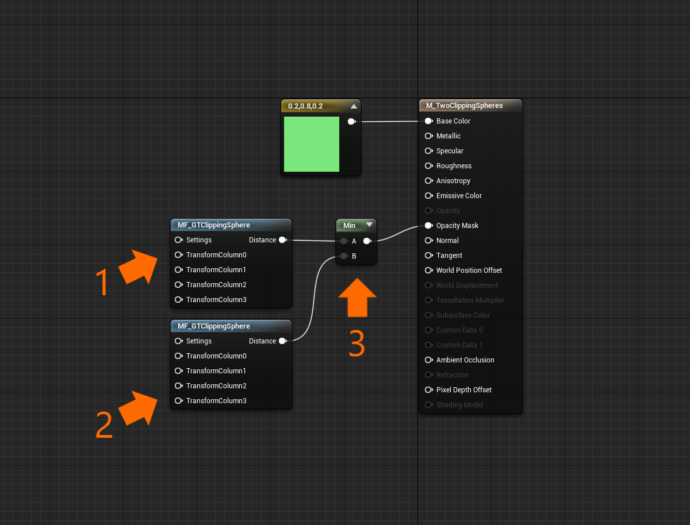

4. It's now time to add two clipping spheres to the level. 
    * From the "Place Actors" panel drop a `GTClippingSphere` actor into the level. 
    * Move the `GTClippingSphere` actor around until it intersects the surface of the the `Sphere` actor. You will notice the sphere discards any pixels that intersect with it. (1)
    * From the "Place Actors" panel drop a second `GTClippingSphere` actor into the level. Move the second `GTClippingSphere` actor around until it intersects the surface of the the `Sphere` actor. You will notice the sphere does **not** discard any pixels that intersect with it. (2)
    * Let's make some changes below to fix this.

    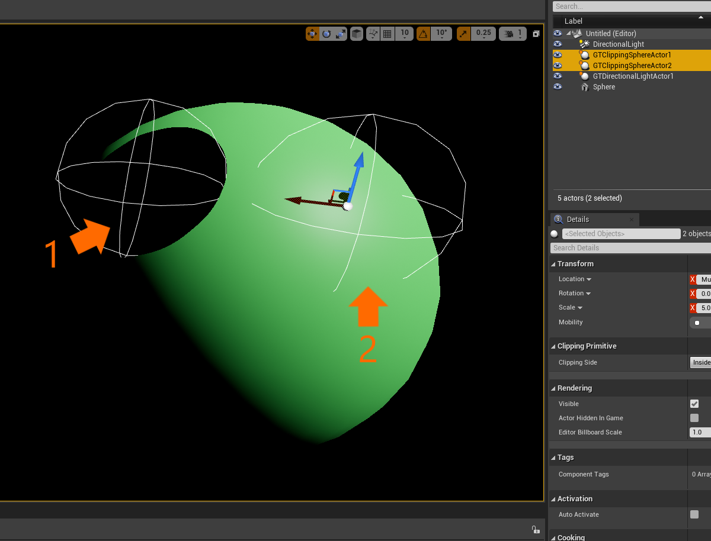

5. Our material needs a mechanism to know about the second clipping sphere. We will use a material parameter collection to do this.
    * Right click within the "Content Browser" and select "Material Parameter Collection" under the "Create Advanced Asset/Materials and Textures" menu listings.
    * Let's name our material parameter collection `MPC_SecondClippingSphere`.
    * Double click on `MPC_SecondClippingSphere` to open the material parameter collection editor.
    * Add five vector parameters (1) that have a default value of black (0, 0, 0, 0). 
    * Name the parameters to match the parameter names found under the advanced tab of the clipping sphere. (2) You are free to change these names to whatever you want if they are unique and match between the clipping primitive and material parameter collection.
    * Finally, assign `MPC_SecondClippingSphere` to the "Parameter Collection Override" property of the second clipping sphere. (3) 

    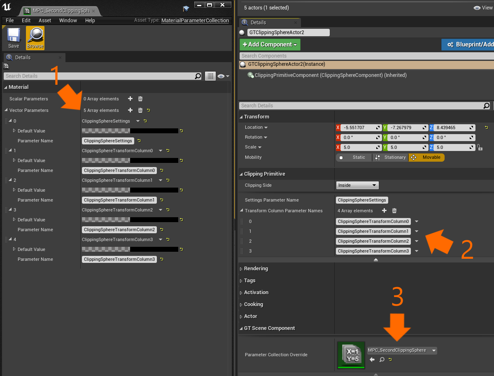

6. Now let's assign the outputs of `MPC_SecondClippingSphere` to the inputs of our second `MF_GTClippingSphere` material function.
    * Double click on the `M_TwoClippingSpheres` material to reopen the material editor.
    * Drag and drop the `MPC_SecondClippingSphere` from the content browser to the material editor.
    * Duplicate the `Collection Param` so that there are a total of five. (1)
    * Select a "Parameter Name" for each `Collection Param` and assign it to the correct `MF_GTClippingSphere` input on the second clipping sphere function. For example, "ClippingSphereSettings" should connect to "Settings."

    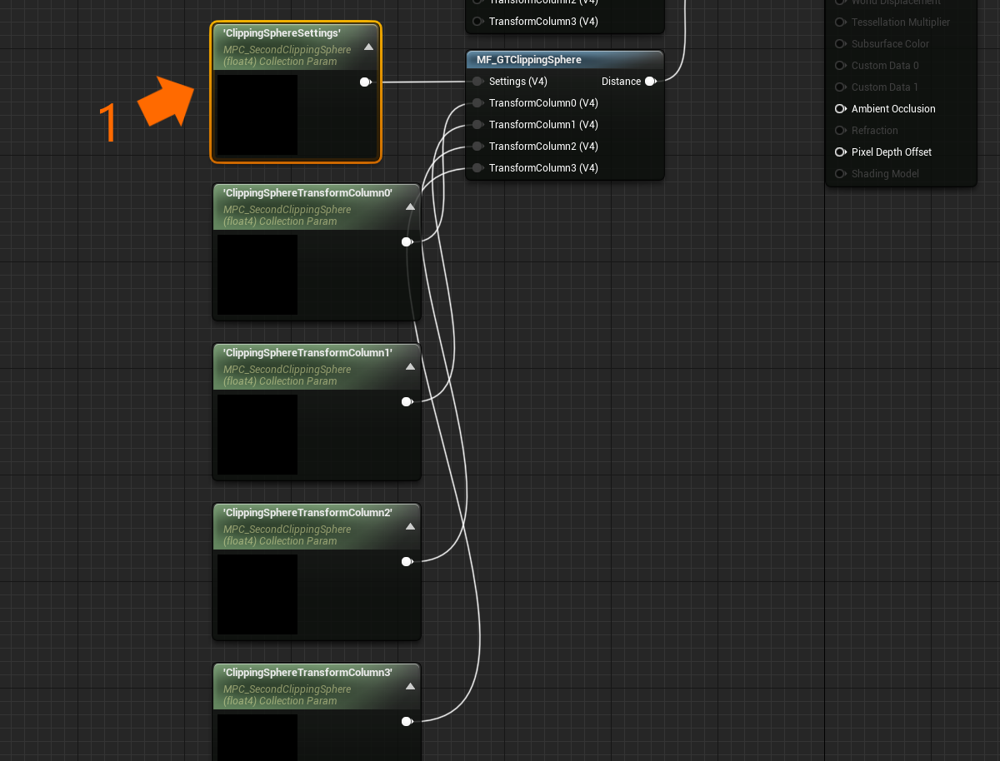

7. Lastly, let's jump back to the level editor to verify our changes have worked.
  * In the level editor move the second `GTClippingSphere` around until it intersects the surface of the the `Sphere` actor.
  * You will now notice the sphere discards any pixels that intersect with it, along with the first sphere.

    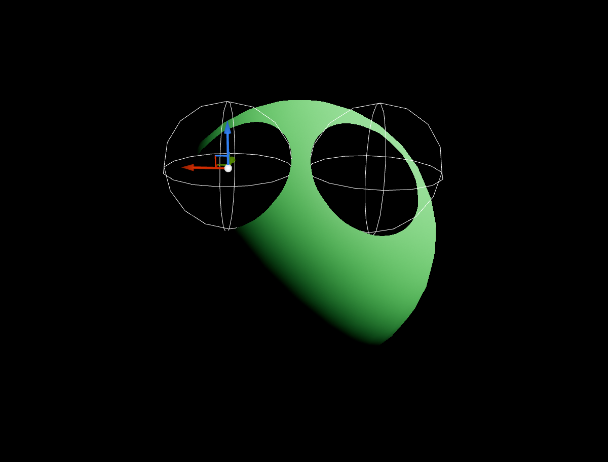

For additional insight into advanced use cases please see the `\GraphicsToolsProject\Plugins\GraphicsToolsExamples\Content\ClippingPrimitives\ClippingPrimitives.umap` level. 

## See also

- [Lighting](Lighting.md)
- [Effects](Effects.md)
